# **나만의 개발 작업실: Docker를 이용한 표준 개발 환경 구축 프로젝트**
#### CLI 기초부터 Docker 기반 웹 서버 운영, Git 버전 관리까지! 이 프로젝트는 Docker와 Git을 활용한 표준화된 개발 환경 구축을 통해 컨테이너 기술의 핵심 원리를 체득하고 실무 역량을 기르는 데 목적이 있습니다.
---

## 1) 실행 환경
- **OS**: macOS Sequoia 15.7.4
- **Shell**: zsh
- **Docker**: 28.5.2 (OrbStack)
- **Git**: 2.53.0


## 2) 수행 체크리스트
- [x] 터미널 기본 명령어 익히기 및 작업 폴더 구성
- [x] chmod를 활용한 접근 권한 관리
- [x] Docker 설치 및 실행 환경 정상 작동 확인
- [x] hello-world 컨테이너 실행 테스트
- [x] 커스텀 Dockerfile 작성 및 이미지 빌드하기
- [x] 포트 매핑 설정을 통한 웹 서버 접속 확인
- [x] 바인드 마운트(Bind Mount)를 이용한 파일 공유
- [x] Docker Volume을 활용한 데이터 보존 실습
- [x] Git 저장소 생성 및 GitHub 원격 저장소 연결


## 3) Docker & Git 개발 환경 구축 전체 로드맵

###  ① 프로젝트 기초 공사
- mkdir my-docker : 프로젝트 폴더 생성 (내 작업실 만들기)
- cd my-docker : 폴더로 이동 (작업실 안으로 들어가기)
- git init : Git 저장소 시작 (이 폴더를 Git이 지금부터 감시하고 기록하기 시작함)
- git config --global user.name "이름" : 내 이름 등록 (누가 기록했는지 남기기 위해)
- git config --global user.email "이메일" : 내 이메일 등록 (연락처 정보 남기기)

###  ② 첫 기록 남기기
- touch README.md : 프로젝트 설명서 파일 생성
- git add README.md : Git에게 "이 파일을 다음 기록(커밋)에 포함할 거야"라고 말하기 (장바구니에 담기)
- git commit -m "첫 커밋" : 현재 상태를 사진 찍듯 기록하여 내 컴퓨터에 저장하기 (최종 구매 확정)

###  ③ Docker 엔진 가동 (중요!)
- OrbStack 실행: Docker 명령어를 쓰기 전 반드시 실행 (기계를 켜는 작업)
- docker run hello-world : Docker 기계가 잘 돌아가는지 테스트 (확인용)

###  ④ 본격적인 코딩 및 설계 (VS Code 활용)
- code . : VS Code로 현재 폴더 열기
- index.html 생성: 웹사이트의 내용을 작성 (예: Hello Docker!)
- Dockerfile 생성: "나만의 서버 이미지"를 만드는 레시피 작성 (Nginx 베이스, 파일 복사 설정)
- docker-compose.yml 생성: Docker 설계도 작성 (이미지, 포트 번호 등 정의)

###  ⑤ 서비스 실행 및 확인
- docker compose up -d --build : 설계도대로 서버를 조립하고 백그라운드에서 실행
- 브라우저 확인: 주소창에 localhost:8080을 입력해 내 웹사이트가 나오는지 확인

###  ⑥ 작업 마무리 (로컬 Git 기록)
- git add . : 새로 만든 모든 파일(html, Dockerfile 등)을 장바구니에 담기
- git commit -m "Nginx 설정 완료" : 오늘 작업한 내용을 내 컴퓨터 Git에 최종 저장

###  ⑦ GitHub에 내보내기 (원격 저장소 연동)
- git remote add origin [GitHub 주소] : 내 컴퓨터와 GitHub 저장소를 연결 (최초 1회)
- git push origin main : 내 컴퓨터의 기록을 GitHub로 전송 (클라우드 백업 및 공유)

###  ⑧ 서비스 관리 및 상태 점검
- docker ps : 현재 실행 중인 컨테이너 목록과 상태 확인 (건강검진)
- docker logs -f [컨테이너명] : 서버 내부의 로그(접속 기록, 에러)를 실시간으로 확인

###  ⑨ 코드 수정 및 업데이트 (반복 작업)
- 파일 수정: VS Code에서 내용을 수정하고 저장
- docker compose up -d --build : 수정한 코드를 서버에 반영하기 위해 다시 조립하고 실행
- 새로고침: 브라우저에서 변경된 내용 확인

###  ⑩ 환경 정리 및 리소스 관리
- docker compose down : 실행 중인 서비스를 완전히 끄고 삭제 (깔끔한 뒷정리)
- docker system prune -a : 사용하지 않는 이미지/컨테이너 찌꺼기를 삭제해 용량 확보

###  ⑪ 협업 및 동기화
- git status : 현재 수정된 파일이 무엇인지 수시로 체크
- git pull origin main : GitHub에 있는 최신 코드를 내 컴퓨터로 가져오기 (※ 내용이 반영되지 않는다면 13단계 Case 2 참고)
- .gitignore 작성: 보안상 중요한 파일이나 불필요한 파일이 Git에 올라가지 않도록 설정

###  ⑫ 나만의 이미지 배포 (심화)
- docker login : Docker Hub 계정으로 로그인
- docker push [내아이디]/이미지명 : 내가 만든 이미지를 인터넷에 올려서 어디서든 사용할 수 있게 만들기


## 4) 검증 방법 및 결과

###  ① 작업 디렉토리 위치 확인

- 명령어 : **% pwd**
- 결과 : /Users/son1732321732/Developer/my-docker2

###  ② 프로젝트 파일 구성 확인

- 명령어 : **% ls -al**
```zsh
son1732321732@c6r3s8 my-docker2 % ls -al
total 88
-rw-r--r--   1 son1732321732  son1732321732      0  8  3 14:43 ③
drwx------  11 son1732321732  son1732321732    352  8  3 19:30 .
drwxr-xr-x   3 son1732321732  son1732321732     96  8  3 11:53 ..
-rw-r--r--   1 son1732321732  son1732321732   6148  8  3 11:53 .DS_Store
drwxr-xr-x  15 son1732321732  son1732321732    480  8  3 21:04 .git
-rw-r--r--   1 son1732321732  son1732321732    292  8  3 11:53 docker-compose.yml
-rw-r--r--   1 son1732321732  son1732321732    521  8  3 11:53 Dockerfile
drwxr-xr-x  13 son1732321732  son1732321732    416  8  3 18:47 images
-rw-r--r--   1 son1732321732  son1732321732    395  8  3 18:04 index.html
drwxr-xr-x   3 son1732321732  son1732321732     96  8  3 19:35 practice-dir
-rw-r--r--   1 son1732321732  son1732321732  22414  8  3 21:05 README.md
```
- 실행화면 : 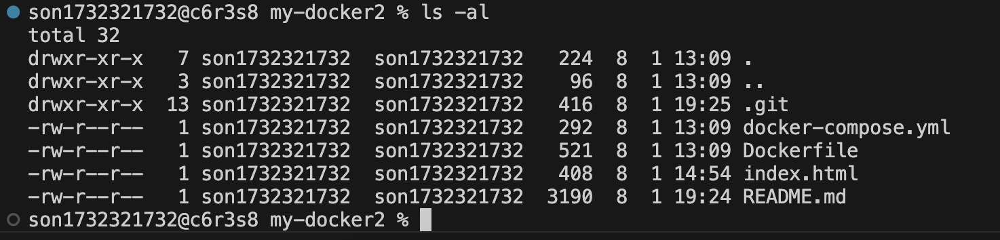
https://github.com/jin1732/my-docker2/commit/6e1e122913868d95e088e497f727b080b3b020f4

###  ③ Git 커밋 이력 확인 (증거 링크와 매칭)
- 명령어 : **% git log --oneline -n 3**
```zsh
son1732321732@c6r3s8 my-docker2 % git log --oneline -n 3
b22f80c (HEAD -> main, origin/main, origin/HEAD) 권한 실습 로그 업데이트
8a95ff7 6) 전체 문서 및 누락된 파일 최종 업데이드 수정
c877ccd 6) 전체 문서 및 누락된 파일 최종 업데이트
```
- 실행화면 : 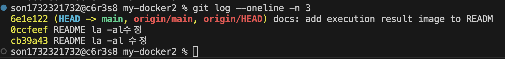
https://github.com/jin1732/my-docker2/commit/3ba0d9d54d37a59cd12bd05e6b1f574056509745

###  ④ Docker 운영 및 검증 로그

####  설치 및 환경 점검 결과
- 명령어: docker --version, docker info
```zsh
son1732321732@c6r3s8 my-docker2 % docker --version                         
Docker version 28.5.2, build ecc6942
son1732321732@c6r3s8 my-docker2 % docker info | head -n 10
Client:
 Version:    28.5.2
 Context:    orbstack
 Debug Mode: false
 Plugins:
  buildx: Docker Buildx (Docker Inc.)
    Version:  v0.29.1
    Path:     /Users/son1732321732/.docker/cli-plugins/docker-buildx
  compose: Docker Compose (Docker Inc.)
    Version:  v2.40.3
WARNING: DOCKER_INSECURE_NO_IPTABLES_RAW is set
```
- 실행 화면: 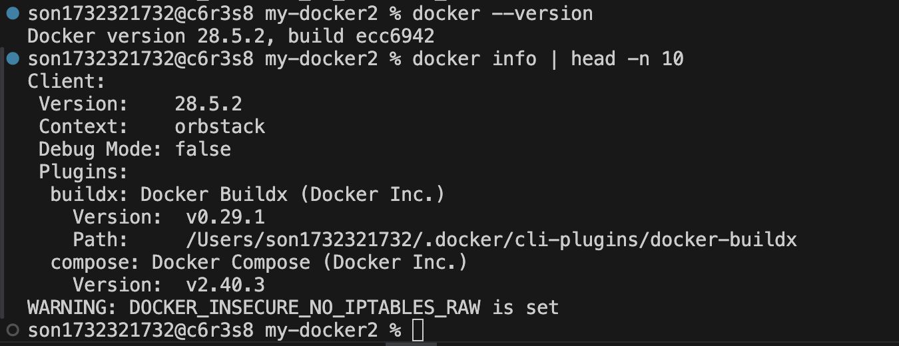
https://github.com/jin1732/my-docker2/commit/e73f4fcc9c24d7d8edaf3547753e0a64b4bc8c7d

#### 이미지 및 전체 컨테이너 목록
- 명령어: docker images, docker ps -a
```zsh
son1732321732@c6r3s8 my-docker2 % docker images
REPOSITORY   TAG       IMAGE ID       CREATED       SIZE
nginx        latest    4e5db4761e0f   2 weeks ago   161MB
son1732321732@c6r3s8 my-docker2 % docker ps -a
CONTAINER ID   IMAGE     COMMAND                   CREATED       STATUS       PORTS                                     NAMES
d4d795587163   nginx     "/docker-entrypoint.…"   5 hours ago   Up 5 hours   0.0.0.0:8080->80/tcp, [::]:8080->80/tcp   my-docker2-web-server-1
```
- 실행 화면: 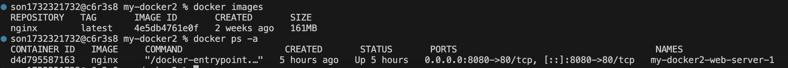
https://github.com/jin1732/my-docker2/commit/4f9383260e2b67308017b1cdc015a0557edb5874

#### Docker 컨테이너 중지 및 삭제
- 명령어 : docker stop, docker rm
```zsh
son1732321732@c6r3s8 my-docker2 % docker stop my-docker2-web-server-1
my-docker2-web-server-1
son1732321732@c6r3s8 my-docker2 % docker ps -a
CONTAINER ID   IMAGE     COMMAND                   CREATED       STATUS                         PORTS     NAMES
3502c9ff17f8   ubuntu    "/bin/bash"               2 hours ago   Exited (0) About an hour ago             my-ubuntu
86302c23ec18   nginx     "/docker-entrypoint.…"   3 hours ago   Exited (0) 12 seconds ago                my-docker2-web-server-1
son1732321732@c6r3s8 my-docker2 % docker rm my-docker2-web-server-1
my-docker2-web-server-1
son1732321732@c6r3s8 my-docker2 % docker ps -a
CONTAINER ID   IMAGE     COMMAND       CREATED       STATUS                         PORTS     NAMES
3502c9ff17f8   ubuntu    "/bin/bash"   2 hours ago   Exited (0) About an hour ago             my-ubuntu
```

#### Docker 컨테이너 실행 상태 확인 
- 명령어 : docker-compose ps
```zsh
son1732321732@c6r3s8 my-docker2 % docker-compose ps
NAME                      IMAGE     COMMAND                   SERVICE      CREATED       STATUS       PORTS
my-docker2-web-server-1   nginx     "/docker-entrypoint.…"   web-server   3 hours ago   Up 3 hours   0.0.0.0:8080->80/tcp, [::]:8080->80/tcp
```
- 실행화면 : 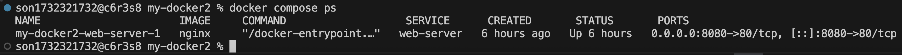
https://github.com/jin1732/my-docker2/commit/f600478a7c0c28d83133bb75fe3b12e19cc81794

#### 서비스 로그 및 리소스 점검
- 명령어: docker logs , docker stats
```zsh
son1732321732@c6r3s8 my-docker2 % docker logs my-docker2-web-server-1
/docker-entrypoint.sh: /docker-entrypoint.d/ is not empty, will attempt to perform configuration
/docker-entrypoint.sh: Looking for shell scripts in /docker-entrypoint.d/
/docker-entrypoint.sh: Launching /docker-entrypoint.d/10-listen-on-ipv6-by-default.sh
10-listen-on-ipv6-by-default.sh: info: Getting the checksum of /etc/nginx/conf.d/default.conf
10-listen-on-ipv6-by-default.sh: info: Enabled listen on IPv6 in /etc/nginx/conf.d/default.conf
/docker-entrypoint.sh: Sourcing /docker-entrypoint.d/15-local-resolvers.envsh
/docker-entrypoint.sh: Launching /docker-entrypoint.d/20-envsubst-on-templates.sh
/docker-entrypoint.sh: Launching /docker-entrypoint.d/30-tune-worker-processes.sh
/docker-entrypoint.sh: Configuration complete; ready for start up
2026/08/03 03:05:12 [notice] 1#1: using the "epoll" event method
2026/08/03 03:05:12 [notice] 1#1: nginx/1.31.3
2026/08/03 03:05:12 [notice] 1#1: built by gcc 14.2.0 (Debian 14.2.0-19) 
2026/08/03 03:05:12 [notice] 1#1: OS: Linux 6.17.8-orbstack-00308-g8f9c941121b1
2026/08/03 03:05:12 [notice] 1#1: getrlimit(RLIMIT_NOFILE): 20480:1048576
2026/08/03 03:05:12 [notice] 1#1: start worker processes
2026/08/03 03:05:12 [notice] 1#1: start worker process 29
2026/08/03 03:05:12 [notice] 1#1: start worker process 30
CONTAINER ID   NAME                      CPU %     MEM USAGE / LIMIT     MEM %     NET I/O         BLOCK I/O        PIDS 
d4d795587163   my-docker2-web-server-1   0.00%     6.289MiB / 15.67GiB   0.04%     1.71kB / 126B   4.1kB / 8.19kB   7 
```
- - 실행 화면: 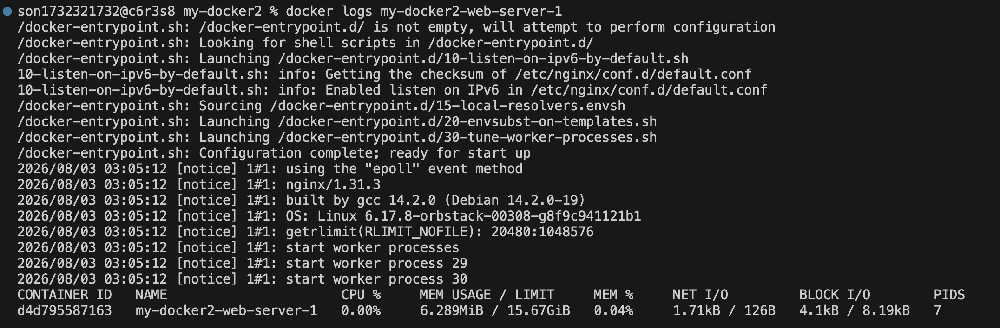
https://github.com/jin1732/my-docker2/commit/6c4cd51770fbd6ab7a113736677d7011dbc782a1


###  ⑤ 웹 서버 응답 확인
- 명령어 : **% curl localhost:8080**
```zsh
<!DOCTYPE html>
<html lang="ko">
<head>
    <meta charset="UTF-8">
    <title>☀︎ 나의 도커서버 만들기 ☀︎</title>
    <style>
        body { font-family: sans-serif; text-align: center; margin-top: 50px; }
        h1 { color: #0969da; }
    </style>
</head>
<body>
    <h1>Docker로 만든 Nginx 서버 작동</h1>
    <p>✨성공적으로 웹 서버를 띄웠어요~ ✨</p>
</body>
</html>  
```
- 실행화면 : 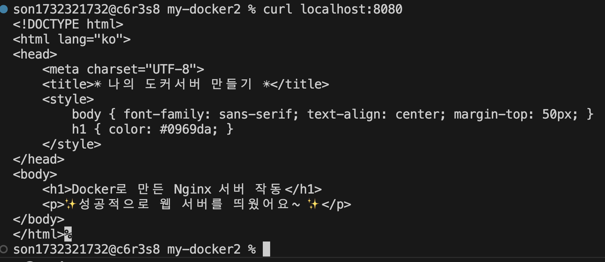
https://github.com/jin1732/my-docker2/commit/099f61a979f3f879c2fab0278768a0cc3c6f61e0


## 5) 실습 기반 트러블슈팅 리포트

### [Case 1] 원격 브랜치 인식 불가

#### ① 문제 상황 (Problem)
- 상황: GitHub 웹 UI에서 test-fix2 브랜치를 새로 생성함.
- 로컬 터미널에서 해당 브랜치로 이동하기 위해 git checkout test-fix2를 입력했으나 에러 발생.
- 에러 메시지: error: pathspec 'test-fix2' did not match any file(s) known to git

#### ② 원인 가설
- 로컬 Git 저장소의 메타데이터(Metadata)가 서버(GitHub)의 최신 상태를 반영하지 못하고 있음.
- 로컬 저장소는 서버에 test-fix2라는 브랜치가 생겼다는 사실을 아직 인지하지 못한 상태임.

#### ③ 상태 확인
- git branch -a 명령어로 전체 브랜치 목록을 확인한 결과, 서버에는 존재하는 test-fix2가 로컬 목록에는 나타나지 않음을 확인.

#### ④ 해결 과정
- git fetch를 실행하여 서버의 최신 브랜치 정보를 로컬로 업데이트.
- 동기화 후 브랜치 목록에 test-fix2가 정상적으로 나타나며, 브랜치 이동(checkout)이 가능해짐.

### [Case 2] 로컬-원격 파일 내용 불일치 문제 

#### ① 문제 상황 (Problem)
- 상황: GitHub 웹 UI에서 test-fix2 README.md 파일을 직접 수정하고 커밋함.
- 현상 : 로컬에서 git checkout test-fix2로 이동은 했으나, 웹에서 수정했던 최신 문구가 파일에 보이지 않음.

#### ② 원인 가설
- 로컬에 브랜치 이름은 존재하지만, 서버에 새로 올라온 **'최신 커밋 데이터'**를 아직 다운로드하지 않았기 때문임.
즉, "브랜치의 존재(정보)"는 알지만 "실제 내용(데이터)"은 과거 상태에 머물러 있음.

#### ③ 상태 확인
- cat README.md 명령어로 파일 내용을 확인한 결과, 원격에서 추가한 문구가 없고 수정 전의 과거 텍스트만 확인됨.

#### ④ 해결 과정
- git pull origin test-fix2 명령어를 실행.
- 서버의 최신 커밋 데이터를 가져와서(fetch) 현재 로컬 파일에 합침(merge). 이후 cat README.md로 최신 내용이 반영된 것을 확인.

### 터미널 조작 로그
- GitHub에서 브랜치를 삭제한 후, `git fetch -p`를 통해 로컬의 원격 브랜치 목록을 동기화한 실제 로그입니다.
- 실행화면 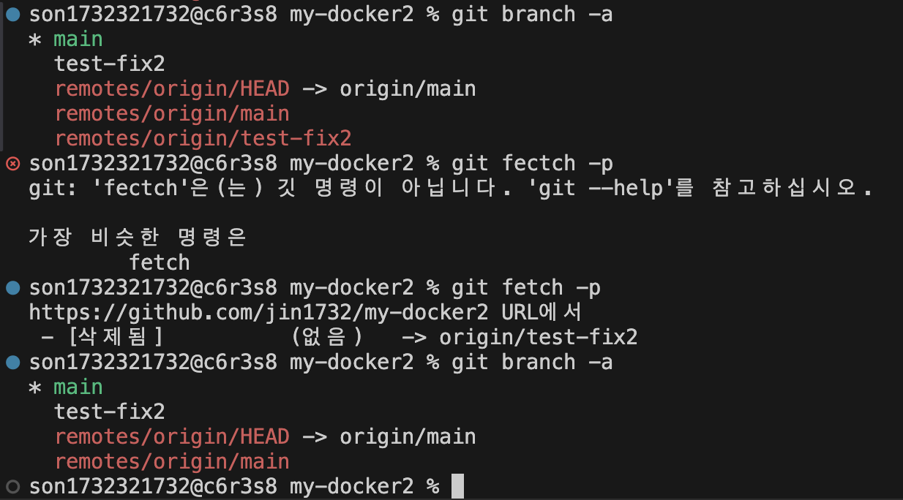
https://github.com/jin1732/my-docker2/commit/f28db6eb4025d8945961a73c688d71149950cce7


##  6) 핵심 제출물 및 상세 검증 증거

###  ① Dockerfile 및 웹 서버 소스코드
- Dockerfile: Nginx 기반 커스텀 이미지 생성 레시피 (./Dockerfile)
```zsh
# 1. 어떤 기존 베이스를 선택했는가: NGINX 최신 버전
FROM nginx:latest

# 2. 커스텀 포인트 1: 이미지 관리자 정보 추가 (메타데이터)
LABEL maintainer="jin1732 <son173232@naver.com>"

# 3. 커스텀 포인트 2: 내가 만든 index.html을 이미지 내부로 복사
# (이 작업을 통해 볼륨 연결 없이도 이미지만 실행하면 내 웹사이트가 뜹니다.)
COPY index.html /usr/share/nginx/html/index.html

# 4. 커스텀 포인트 3: 80번 포트 개방 명시
EXPOSE 80
```
- index.html: 서비스 메인 페이지 소스코드 (./index.html)
```zsh
<!DOCTYPE html>
<html lang="ko">
<head>
    <meta charset="UTF-8">
    <title>☀︎ 나의 도커서버 만들기 ☀︎</title>
    <style>
        body { font-family: sans-serif; text-align: center; margin-top: 50px; }
        h1 { color: #0969da; }
    </style>
</head>
<body>
    <h1>Docker로 만든 Nginx 서버 작동</h1>
    <p>✨성공적으로 웹 서버를 띄웠어요~ ✨</p>
</body>
</html>  
```
- 빌드/실행 로그: docker compose up -d --build 실행 시 이미지 빌드 및 컨테이너 생성 완료 로그 확인
```zsh
son1732321732@c6r3s8 my-docker2 % docker compose down
[+] Running 2/2
 ✔ Container my-docker2-web-server-1  Removed                                                                                   0.4s 
 ✔ Network my-docker2_default         Removed                                                                                   0.1s 
son1732321732@c6r3s8 my-docker2 % docker compose up -d --build
[+] Running 2/2
 ✔ Network my-docker2_default         Created                                                                                   0.1s 
 ✔ Container my-docker2-web-server-1  Started                                                                                   0.4s 
son1732321732@c6r3s8 my-docker2 % 
```
이미지가 이미 최신 상태라 빌드 과정이 생략되었지만, 네트워크와 컨테이너가 정상적으로 생성 및 시작된 것을 확인할 수 있습니다
https://github.com/jin1732/my-docker2/commit/7f4b3fa819ce3aeb7a1f7352536d06f368c5e435


###  ② 포트 매핑(Port Mapping) 접속 확인
- 설정: 8080:80 (호스트 포트 8080을 컨테이너 80으로 매핑)
```zsh
CONTAINER ID   IMAGE     COMMAND                   CREATED          STATUS          PORTS                                     NAMES
0b92fb465e1d   nginx     "/docker-entrypoint.…"   10 minutes ago   Up 10 minutes   0.0.0.0:8080->80/tcp, [::]:8080->80/tcp   my-docker2-web-server-1
```
- 실행화면 : 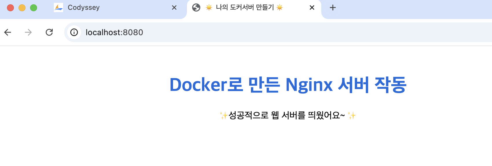
https://github.com/jin1732/my-docker2/commit/d346b6c6e9a99750973d590206c70e0a3a3f6744

###  ③ 바인드 마운트(Bind Mount) 실시간 반영 증거
- 검증 방법: 호스트의 index.html 수정 시 컨테이너 재시작 없이 반영되는지 확인
- 실행화면 : 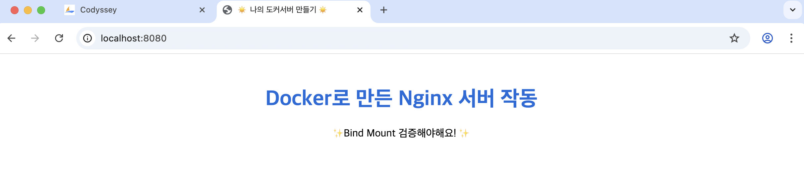
 index.html 파일을 수정한 후 브라우저를 새로고침하여, 변경된 내용이 즉시 동기화된 것을 검증하였습니다. (②번 항목의 초기 화면과 변경 사항 비교)
https://github.com/jin1732/my-docker2/commit/aeb47574c6a9ef008f13dd95771608963b8b2d53


### ④ Docker 볼륨(Volume) 데이터 영속성 증거
- 검증 방법: 컨테이너 삭제(down) 후 재실행(up) 시에도 데이터가 유지되는지 확인
```zsh
son1732321732@c6r3s8 my-docker2 % docker compose down
[+] Running 2/2
 ✔ Container my-docker2-web-server-1  Removed                                                                                   0.4s 
 ✔ Network my-docker2_default         Removed                                                                                   0.1s 
son1732321732@c6r3s8 my-docker2 % docker compose up -d
[+] Running 2/2
 ✔ Network my-docker2_default         Created                                                                                   0.1s 
 ✔ Container my-docker2-web-server-1  Started                                                                                   0.3s 
son1732321732@c6r3s8 my-docker2 % 
```
- 결과 : docker compose down으로 컨테이너를 완전히 삭제한 후 다시 생성했음에도, 바인드 마운트된 index.html의 수정 내용이 유실되지 않고 유지됨을 확인했습니다. 이는 컨테이너 인프라 환경에서 데이터 영속성이 성공적으로 구현되었음을 의미합니다.


###  ⑤ Git & GitHub & VSCode 연동 증거
- Git 설정: git config를 통한 사용자 이름/이메일 등록 완료
```zsh
son1732321732@c6r3s8 my-docker2 % git config --list
credential.helper=osxkeychain
user.name=jin1732
user.email=son173232@naver.com
```
- GitHub 연동: git remote -v 명령어로 원격 저장소(origin) 연결 확인
```zsh
son1732321732@c6r3s8 my-docker2 % git remote -v
origin  https://github.com/jin1732/my-docker2.git (fetch)
origin  https://github.com/jin1732/my-docker2.git (push)
```
- VSCode 연동: VSCode 계정(Accounts) 설정을 통한 GitHub 로그인 확인 및 소스 제어(Source Control) 패널을 이용한 실시간 동기화(Push/Pull) 상태 검증.
실행화면 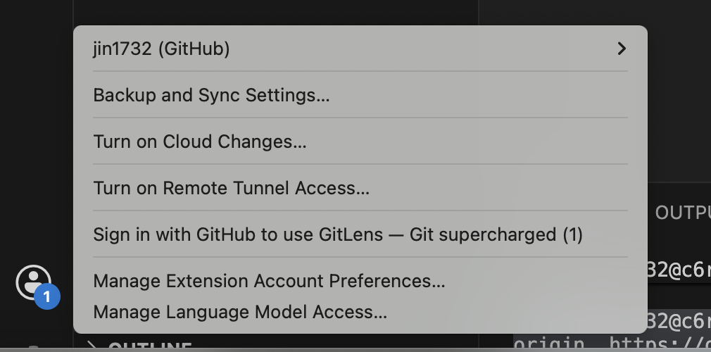
https://github.com/jin1732/my-docker2/commit/27db9dab6e4fd7d233de91e0ec9454685bb95d50


###  ⑥ 터미널 조작 및 파일 관리 로그
- 명령어 : mkdir, touch, cp, mv, rm, cat 숙달 확인
```zsh
son1732321732@c6r3s8 my-docker2 % mkdir practice-dir
son1732321732@c6r3s8 my-docker2 % cd practice-dir
son1732321732@c6r3s8 practice-dir % touch memo.txt
son1732321732@c6r3s8 practice-dir % echo "Terminal Practice" > memo.txt
son1732321732@c6r3s8 practice-dir % cat memo.txt
Terminal Practice
son1732321732@c6r3s8 practice-dir % cp memo.txt memo_copy.txt
son1732321732@c6r3s8 practice-dir % mv memo_copy.txt renamed_memo.txt
son1732321732@c6r3s8 practice-dir % ls
memo.txt                renamed_memo.txt
son1732321732@c6r3s8 practice-dir % rm renamed_memo.txt
son1732321732@c6r3s8 practice-dir % ls
memo.txt
```

###  ⑦ 권한 실습: chmod 명령어를 통한 파일 권한 변경 전/후 비교
- 파일 권한 실습 (ls -ld, chmod)
```zsh
son1732321732@c6r3s8 practice-dir % ls -ld memo.txt
-rwxr-xr-x  1 son1732321732  son1732321732  18  8  3 19:33 memo.txt
son1732321732@c6r3s8 practice-dir % chmod 755 memo.txt
son1732321732@c6r3s8 practice-dir % ls -ld memo.txt
-rwxr-xr-x  1 son1732321732  son1732321732  18  8  3 19:33 memo.txt
son1732321732@c6r3s8 practice-dir % 
```
- 디렉토리 권한 실습 (ls -ld, chmod)
```zsh
son1732321732@c6r3s8 my-docker2 % ls -ld                                      
drwxr-xr-x  11 son1732321732  son1732321732  352  8  3 19:30 .
son1732321732@c6r3s8 my-docker2 % chmod 700 .
son1732321732@c6r3s8 my-docker2 % ls -ld .
drwx------  11 son1732321732  son1732321732  352  8  3 19:30 .
son1732321732@c6r3s8 my-docker2 % 
```

###  ⑧ Ubuntu 컨테이너 실습 및 개념 정리
- 목적: OS 베이스 이미지 실행 및 컨테이너 제어 방식 이해

#### Ubuntu 컨테이너 실행 및 내부 조작
- 명령어 : docker run -it --name my-ubuntu ubuntu /bin/bash
```zsh
son1732321732@c6r3s8 practice-dir % docker run -it --name my-ubuntu ubuntu /bin/bash
Unable to find image 'ubuntu:latest' locally
latest: Pulling from library/ubuntu
ed819469700f: Pull complete 
a3679419df18: Pull complete 
Digest: sha256:3131b4cc82a783df6c9df078f86e01819a13594b865c2cad47bd1bca2b7063bb
Status: Downloaded newer image for ubuntu:latest
root@3502c9ff17f8:/# 
```
#### 개념 정리: 컨테이너 접속 방식(attach vs exec)의 차이점
- 명령어 : attach_원래 떠 있는 화면으로 들어가는 방식 (**exit 하면 컨테이너 종료**)
```zsh
son1732321732@c6r3s8 practice-dir % docker attach my-ubuntu
root@3502c9ff17f8:/# ls
bin  boot  dev  etc  hello.txt  home  lib  lib64  media  mnt  opt  proc  root  run  sbin  srv  sys  test_dir  tmp  usr  var
root@3502c9ff17f8:/# exit
exit
son1732321732@c6r3s8 practice-dir % docker ps
CONTAINER ID   IMAGE     COMMAND                   CREATED       STATUS       PORTS                                     NAMES
86302c23ec18   nginx     "/docker-entrypoint.…"   2 hours ago   Up 2 hours   0.0.0.0:8080->80/tcp, [::]:8080->80/tcp   my-docker2-web-server-1
son1732321732@c6r3s8 practice-dir % 
```

- 명령어 : exec_새 창을 열고 들어가는 방식 (**exit 해도 컨테이너 유지**)
```zsh
root@3502c9ff17f8:/# exit
exit
son1732321732@c6r3s8 practice-dir % docker ps
CONTAINER ID   IMAGE     COMMAND                   CREATED       STATUS       PORTS                                     NAMES
86302c23ec18   nginx     "/docker-entrypoint.…"   2 hours ago   Up 2 hours   0.0.0.0:8080->80/tcp, [::]:8080->80/tcp   my-docker2-web-server-1
son1732321732@c6r3s8 practice-dir % docker start my-ubuntu
my-ubuntu
son1732321732@c6r3s8 practice-dir % docker exec -it my-ubuntu /bin/bash
root@3502c9ff17f8:/# #
root@3502c9ff17f8:/# ls
bin  boot  dev  etc  home  lib  lib64  media  mnt  opt  proc  root  run  sbin  srv  sys  tmp  usr  var
root@3502c9ff17f8:/# mkdir test_dir
root@3502c9ff17f8:/# touch hello.txt
root@3502c9ff17f8:/# ls
bin  boot  dev  etc  hello.txt  home  lib  lib64  media  mnt  opt  proc  root  run  sbin  srv  sys  test_dir  tmp  usr  var
root@3502c9ff17f8:/# whoami
root
root@3502c9ff17f8:/# pwd
/
root@3502c9ff17f8:/# cat /etc/os-release
PRETTY_NAME="Ubuntu 26.04 LTS"
NAME="Ubuntu"
VERSION_ID="26.04"
VERSION="26.04 LTS (Resolute Raccoon)"
VERSION_CODENAME=resolute
ID=ubuntu
ID_LIKE=debian
HOME_URL="https://www.ubuntu.com/"
SUPPORT_URL="https://help.ubuntu.com/"
BUG_REPORT_URL="https://bugs.launchpad.net/ubuntu/"
PRIVACY_POLICY_URL="https://www.ubuntu.com/legal/terms-and-policies/privacy-policy"
UBUNTU_CODENAME=resolute
LOGO=ubuntu-logo
root@3502c9ff17f8:/# exit
exit
son1732321732@c6r3s8 practice-dir % docker ps
CONTAINER ID   IMAGE     COMMAND                   CREATED          STATUS         PORTS                                     NAMES
3502c9ff17f8   ubuntu    "/bin/bash"               11 minutes ago   Up 4 minutes                                             my-ubuntu
86302c23ec18   nginx     "/docker-entrypoint.…"   2 hours ago      Up 2 hours     0.0.0.0:8080->80/tcp, [::]:8080->80/tcp   my-docker2-web-server-1
son1732321732@c6r3s8 practice-dir % 
```

###  ⑨ Dockerfile 기반 커스텀 이미지 제작 및 배포
#### Dockerfile 및 설정 파일 확인
- 명령어 : cat Dockerfile
```zsh
son1732321732@c6r3s8 my-docker2 % cat Dockerfile
# 1. 어떤 기존 베이스를 선택했는가: NGINX 최신 버전
FROM nginx:latest

# 2. 커스텀 포인트 1: 이미지 관리자 정보 추가 (메타데이터)
LABEL maintainer="jin1732 <son173232@naver.com>"

# 3. 커스텀 포인트 2: 내가 만든 index.html을 이미지 내부로 복사
# (이 작업을 통해 볼륨 연결 없이도 이미지만 실행하면 내 웹사이트가 뜹니다.)
COPY index.html /usr/share/nginx/html/index.html

# 4. 커스텀 포인트 3: 80번 포트 개방 명시
EXPOSE 80%     
```

#### 커스텀 이미지 빌드 및 컨테이너 실행
- 명령어 : docker-compose up -d --build
```zsh
[+] Running 1/1
 ✔ Container my-docker2-web-server-1  Started     
 ```

#### 최종 웹 서버 응답 확인 (curl)
- 명령어 : curl localhost:8080
```zsh
son1732321732@c6r3s8 my-docker2 % curl localhost:8080

<!DOCTYPE html>
<html lang="ko">
<head>
    <meta charset="UTF-8">
    <title>☀︎ 나의 도커서버 만들기 ☀︎</title>
    <style>
        body { font-family: sans-serif; text-align: center; margin-top: 50px; }
        h1 { color: #0969da; }
    </style>
</head>
<body>
    <h1>Docker로 만든 Nginx 서버 작동</h1>
    <p>✨Bind Mount 검증해야해요! ✨</p>
</body>
</html>%   
```

